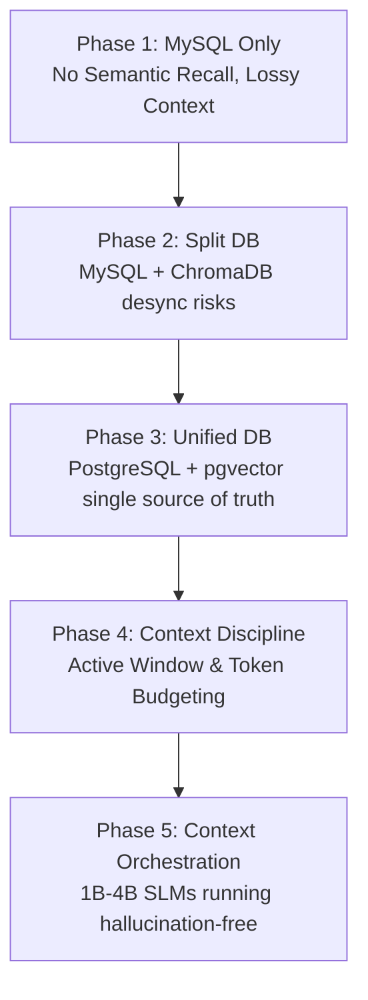

# Case Study — Context Engineering & Memory Optimization (SLM Edge AI)

This document presents a technical case study detailing the memory architecture transitions, context engineering strategies, and local-first performance optimizations implemented in the `AI-Discord` bot. This case study highlights how a consumer-grade system can run stable, low-latency, and highly contextual personal assistants under a strict 4K token constraint.

---

## 💎 1. The Core Challenge: The Context Bloat Problem

Early iterations of the Discord AI assistant suffered from **Attention Dilution**, high response latencies, and frequent hallucinations when using Small Language Models (SLMs) such as Qwen-4B or `gemma3:1b-it-qat`. 

> [!IMPORTANT]
> A 4K context window is not small if the system is disciplined, but it becomes extremely fragile when history, RAG, tool outputs, metadata, and multimodal context are allowed to grow without strict backend-enforced budgets. The primary bottleneck was not the model size alone, but uncontrolled context allocation.

The primary cause was **Context Bloat**:
* Feeding raw channel names, channel biographies, user display names, absolute timestamps, and server metadata blindly on every query.
* Packing standard conversation history (e.g. 24 turns of 520 characters each) blindly into the prompt, consuming up to ~3,100 tokens out of a maximum 4,096 tokens.
* Letting tool outputs (such as massive web search results or full database scans) flood the system prompt.
* Relying on a fragmented MySQL + ChromaDB split-database architecture, which caused synchronization lag, duplicate data paths, and high VRAM overhead on local nodes.

---

## 🔄 2. The Architectural Evolutions

To build a high-performance local AI companion, we executed three primary architectural shifts:

### A. Unified Database Schema (PostgreSQL + pgvector)
* **Old Way**: SQLite/MySQL for message logging, paired with ChromaDB for vector memory. This split caused database drift, duplicate vector memory blocks, and elevated RAM usage.
* **New Way**: A unified PostgreSQL database using the `pgvector` extension with an **HNSW (Hierarchical Navigable Small World)** index. The raw text and its 768-dimensional embedding share the exact same physical row in the `messages` table.
* **Result**: Zero data drift, reduced database transaction complexity, and sub-millisecond similarity lookups.

```sql
-- Unified Row Schema
CREATE TABLE IF NOT EXISTS messages (
    id BIGSERIAL PRIMARY KEY,
    bot_id BIGINT NOT NULL,
    channel_id BIGINT NOT NULL,
    username VARCHAR(255),
    role VARCHAR(20) CHECK (role IN ('system', 'user', 'assistant')),
    content TEXT,
    embedding vector(768),  -- nomic-embed-text dimensions
    created_at TIMESTAMP DEFAULT CURRENT_TIMESTAMP
);
```

### B. Active Scrolling Window Context
* **Old Way**: Feeding a fixed count of past messages (e.g. 24 turns). This would frequently hit the model's 4K token ceiling, prompting Ollama to discard system instructions, which led to hallucinations.
* **New Way**: A budget-aware, reverse-chronological scrolling compiler.
  * In **Lean Mode**, the total history character count is capped at **1,500 characters** (~375 tokens).
  * The compiler loops backward from the newest message, accumulating turns until the budget is saturated.
  * If older history was excluded, a `...` indicator is prepended to represent context truncation.
* **Result**: The history footprint stays flat and predictable, keeping processing latencies low and protecting system directives.

### C. Hardcoded Tool Context Budgets (Context-Aware Allocation)
* **Philosophy**: Do not let the AI choose or retrieve arbitrary amounts of context. The backend must enforce hard, non-negotiable budgets on every tool input and output.
* **Implementation**:
  * **RAG / Memory Tool**: Budgets are limited to `max_memory_chars = 1400` (~350 tokens).
  * **Web Search Tool**: Capped at **3 results** and **280 characters** per result snippet.
  * **Vision Tool**: Compresses and scales images dynamically down to **480p** (in Lean Mode) or **720p** (in Standard Mode).
  * **Metadata Allocation**: Metadata is treated as a selective block with a capped budget of **200–400 characters**, preventing system variables from overwhelming the prompt.

---

## 🧠 3. Hybrid Memory Retrieval: The "5 Days Ago" Temporal Challenge

A common limitation of pure Vector/Semantic search is that semantic similarity calculations (e.g. cosine distance) struggle with precise temporal requests. If a user asks: *"What did my chat 5 days ago contain?"*, a pure vector search for "5 days ago" will return results containing the semantic words "5 days ago" rather than messages actually created on that calendar date.

To solve this, we implemented **Hybrid Memory Retrieval**:

```mermaid
graph TD
    User([User Prompt: 'Chat 5 days ago']) --> Parser{Temporal Parser}
    
    Parser -->|Temporal Intent Detected| RelDate[1. Compute target absolute date]
    Parser -->|Semantic Intent Detected| VecSearch[2. Calculate cosine similarity]
    
    RelDate --> SQLQuery[PostgreSQL Filter: created_at BETWEEN start AND end]
    SQLQuery --> PromptCompiler[Prompt Compiler]
    VecSearch --> PromptCompiler
    
    PromptCompiler --> SLM[SLM Inference (4K Window)]
```

### Flow Control:
1. **Temporal Filtering**: The backend detects relative time references (e.g., "yesterday," "5 days ago").
2. **Metadata Lookup**: It queries PostgreSQL directly using precise timestamp ranges (`WHERE created_at BETWEEN start_of_day AND end_of_day`).
3. **Semantic Hybrid Integration**: If a topic is specified (e.g., *"What did we talk about regarding model models 5 days ago?"*), it overlays a pgvector search filtered by that date range.
4. **Context Assembly**: The parsed database records are summarized and fed to the active scrolling context, preserving memory integrity without flooding the short-term window.

---

## 📈 4. Architectural Summary

| Memory Tier | Storage / Layer | Purpose | Context Budget |
| :--- | :--- | :--- | :--- |
| **Short-Term Context** | Memory / `deque` RAM Buffer | Immediate conversation flow | Capped strictly at 1,500 chars (Lean Mode) |
| **Long-Term Memory** | PostgreSQL Raw Logs | Precise temporal filtering & history metadata | Queried selectively (WHERE constraints) |
| **Semantic Recall** | pgvector HNSW Index | Meaning similarity & topic association | Capped strictly at 1,400 chars |
| **Tool Inputs** | API Controllers | Search and vision constraints | Capped strictly at source (e.g. 480p, 3 results) |

By implementing this **Context Allocation & Allocation Framework**, the bot delivers a highly personalized, contextual experience with rich long-term recall, while running smoothly on lightweight local models on standard consumer hardware.

---

## 📈 5. Evolution Journey: The Context & Memory Paradigm Shifts

Through iterative debugging and real-world deployment on consumer hardware, we realized a crucial rule of Edge AI Engineering: **Hallucination is not always caused by model size limitations; it is frequently the result of poor context engineering.**

The memory architecture of the `AI-Discord` bot evolved across five distinct developmental phases:



### Phase 1: The Raw Chat Logging Era (MySQL Only)
* **Design**: Standard relational storage of conversations.
* **Limitations**: Zero semantic retrieval. The system relied on feeding raw chronological dumps, leading to a "forgetful" AI that could not connect similar threads across sessions.

### Phase 2: The Two Sources of Truth Era (MySQL + ChromaDB Split DB)
* **Design**: MySQL stored the chat transaction logs; ChromaDB acted as the isolated semantic vector database.
* **Failure Vectors**: High synchronization overhead and memory corruption bugs. If a chat record was modified or deleted in MySQL, ChromaDB remained unsynced. A slight lag or cleanup script failure left the agent with corrupted memory states, triggering severe hallucinations.
* **HNSW Limitation in Isolation**: While HNSW inside ChromaDB accelerated semantic search speed, it lacked integration with relational attributes. If the user asked *"What did I ask 5 days ago?"*, the vector database only performed cosine similarity search on the text "5 days ago", returning completely irrelevant semantic content instead of actual temporal data.

### Phase 3: The Unified Vault (PostgreSQL + pgvector + HNSW Indexing)
* **Design**: Converted all storage to a unified database. Both relational chat logs, user metadata, and vector embeddings share the exact same physical database row.
* **Impact**: Guaranteed ACID transaction consistency. Removing ChromaDB dropped VRAM/RAM overhead by 1.2GB and eliminated desync vectors entirely.
* **Synergy of HNSW & Relational Data**: By embedding HNSW directly onto the PostgreSQL table (`CREATE INDEX ON messages USING hnsw (embedding vector_cosine_ops)`), we gained the ability to run **Hybrid Queries** (e.g. searching semantic similarities restricted precisely to a date range or a specific user using standard SQL `WHERE` filters).

### Phase 4: Dealing with Context Bloat
* **Insight**: Even with pgvector + HNSW delivering sub-millisecond, accurate memory retrieval, 1B–4B small models still hallucinated. We discovered that **model drowning** occurs when too much correct data floods the context.
* **The Math of Drowning**:
  * System Prompt: 1,200 tokens
  * Raw RAG / Memories: 1,400 tokens
  * Conversational History: 1,800 tokens
  * Tool Inputs / Search Snippets: 1,000 tokens
  * **Total Prompt Size: 5,400 tokens** (Target Model Ceiling: 4,096 tokens)
* **Behavior**: In an overfilled prompt, the SLM's attention span diluted. It ignored core instructions (e.g. system safety protocols) and anchored onto old conversation chunks.

### Phase 5: Complete Context Orchestration (The Consumer-Grade Vision)
We resolved model drowning by moving away from relying on "model intelligence" and moving toward **strict context discipline**. We built a 5-tier guardrail system:
1. **Unified Storage (PostgreSQL + pgvector + HNSW)**: For clean memory persistence and hybrid queries.
2. **RAG Retrieval Budget**: Hard-capped semantic queries to `max_memory_chars = 1400`.
3. **Active Scrolling Context Window**: Dynamically trims history using character budgets rather than message counts, ensuring the recent memory footprint stays flat and flat-lines token usage.
4. **Hard-Capped Tool Budgets**: Restricts vision scale (480p/720p) and web search results (3 snippets of 280 chars) to prevent context hijacking.
5. **Lean Mode Prompt Tiering**: Strips non-essential instructions, saving up to ~400 tokens per prompt.

#### 🎛️ Policy Extension: Lightweight Dynamic RAG Gate
To prevent RAG operations from polluting the prompt on low-value/casual chats while avoiding total memory blindness on complex queries, we introduced a tiered **Lightweight Retrieval Policy** designed specifically for consumer-grade systems:

* **Dynamic RAG Gate Premise**: Context discipline does not mean starving the model. The system must retrieve enough evidence to answer safely, while enforcing strict budgets so retrieved data does not overwhelm the active prompt.
* **Absent Memory Guardrail**: When no long-term memory is retrieved, the model is explicitly informed that memory is absent for the current turn via an injected instruction:
  > *"No long-term memory was retrieved for this turn. Do not claim to remember prior details unless they are present in the active context."*
  This safety layer strips the model's ability to falsely claim continuity or invent prior details, forcing it to ask the user for clarification when historical facts are missing.

* **Tiered Retrieval Budgets**:
  * **`RAG_NONE`**: Used only for low-value casual messages, acknowledgments, or single-word inputs (e.g., `ok`, `wkwk`, `lol`). Skip database retrieval entirely.
  * **`RAG_LIGHT`**: Default fallback for ambiguous continuity, project references, code/debug context, or meaningful follow-up messages (allocates **1 result**, max **500 characters**).
  * **`RAG_FULL`**: Triggered by explicit multilingual memory, temporal, project, or prior-discussion cues (allocates **2-3 results**, max **1400 characters**).

---

## 💡 6. Vision & Core Engineering Philosophy: The Consumer Edge

The entire architecture of the Synthover Framework is guided by a central engineering principle: **Do not increase system size; increase system efficiency.**

Instead of taking the brute-force route of demanding high-end enterprise hardware (like an RTX 4090 or RTX 5090) or using heavy cloud models that compromise privacy, we target accessibility for the everyday consumer. The boundary is set at the **NVIDIA RTX 2000 Series (Turing Architecture)**—the physical beginning of hardware tensor cores on consumer-grade PCs.

By optimizing the software to work within these hardware boundaries, we achieved the following:

```
[Brute Force Development]             [Synthover Context Engineering]
Demand massive RTX 5090 GPUs    -->   Optimized for RTX 2000 / 3060 entry points
Context size up to 128K tokens  -->   Strict 4K context budgeting (Lean Mode)
Split DB (MySQL + ChromaDB)     -->   Unified DB (PostgreSQL + pgvector + HNSW)
Large, slow 30B LLM models      -->   Fast, focused 1B - 4B SLM models
```

This case study proves that with disciplined context orchestration, clean database consolidation, and strict token economy, small local models running on standard consumer machines can act with the speed, accuracy, and intelligence of large-scale systems.

---

## 🛠️ 7. Deep-Dive: Design Decisions & Architectural Trade-offs

During the planning and optimization pass for the **Lightweight Dynamic RAG Gate** and **Memory Honesty Protocol**, several crucial micro-decisions and edge cases were analyzed and solved.

### A. The Multilingual Query Edge Case
* **The Problem**: Relying strictly on a hardcoded list of Indonesian memory keywords (`ingat`, `kemarin`, `dulu`) works well for local chats, but instantly breaks the retrieval pipeline when users chat in English (`remember`, `yesterday`), Japanese (`覚えてる`, `昨日`), or Dutch (`herinner`, `gisteren`).
* **The Trade-off**: Writing static dictionary translation lists for dozens of languages is a maintenance nightmare. Meanwhile, using a local LLM-based intent classifier to detect memory intent on every turn is too heavy for an RTX 2060 6GB GPU, adding VRAM pressure and latency.
* **The Solution**: We implemented a **Hybrid Punctuation-Normalized Keyword Gate**:
  * Normalize incoming messages by stripping punctuation first (e.g. `halo!` becomes `halo`) before matching against `CASUAL_UTTERANCES`. This prevents short casual remarks with punctuation from erroneously triggering memory searches.
  * Define a compact, multilingual core list of memory cues (ID, EN, JP).
  * Use **RAG_LIGHT** (1 result, 500 characters max) as a safe fallback for ambiguous or longer inputs that do not match explicit cues but might imply continuity (e.g., *"lanjut yang tadi"*, *"previous bug?"*). This guarantees the model never goes completely blind on foreign languages, while keeping token consumption low.

### B. Epistemic Memory Status (Honesty Warnings)
* **The Logic**: Why separate the system prompt warning between `RAG_NONE` and `RAG_LIGHT`/`RAG_FULL` empty returns?
* **The Reason**:
  * If the RAG mode is `none` (e.g., casual greeting like *"halo"*), memory search was deliberately skipped. Injected Warning: `No long-term memory was retrieved for this turn.` (In Lean Mode, we keep this to a single sentence: `No long-term memory was retrieved. Do not claim prior memory unless shown in context.` to save precious token overhead).
  * If the RAG mode was `light` or `full` but the search yielded no database rows, it means the database was queried but no semantically relevant records were found. Injected Warning: `A long-term memory search was attempted, but no relevant memory was found. Do not invent prior details.`
* **The Benefit**: By informing the model *why* there is no memory in its active context, we prevent it from guessing or generating false continuity statements (*"Oh yes, I remember that..."*). Instead, the model acts honestly and asks the user for clarification.

### C. Regex Audio Pre-processing Order
* **The Bug**: Stripping markdown brackets (`[` and `]`) early in the preprocessing chain destroyed the TTS tag engine (e.g., `[laugh]` or `[hmm]` became `laugh` or `hmm` and were spoken verbally by the TTS instead of triggering raw audio assets or musical hums).
* **The Fix**: The text is first split by brackets `(\[[a-zA-Z0-9:_\-]+\])` to isolate structural audio tags. Once isolated, the markdown stripping regex (`[*_~`#>\\]`) and list-item bullets strip (`(?m)^[ \t]*[-*•][ \t]+`) are executed **only on normal text chunks**. Inner hyphens (like `RTX-2060` or `GPT-SoVITS`) are preserved to maintain natural speech pacing.


